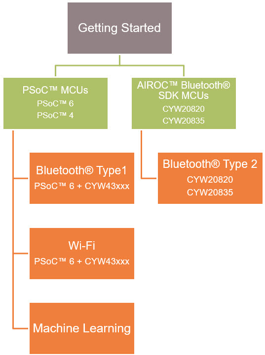

# ModusToolbox™ Software Training

This page contains links to ModusToolbox™ training classes that are available on GitHub. These classes are organized in a modular fashion and broken into levels. Each class is focused on a specific area so that you can learn about a topic quicker and build upon your knowledge as your needs evolve.

The level 1 getting started class covers the basic concepts and building blocks of ModusToolbox™. Level 2 classes cover a product or product family such as PSoC™. Level 3 classes cover more advanced systems such as Bluetooth®, Wi-Fi, or Machine Learning.

[ModusToolbox™ Software Training Level 1 - Getting Started](https://github.com/infineon/training-modustoolbox-level1-getting-started)

- This is the entry-level ModusToolbox™ training class. It is a pre-requisite for all level 2 and level 3 ModusToolbox™ training classes.

- This class is a survey of the ModusToolbox™ development platform.  The learning objective is to introduce you to all the tools in the ModusToolbox™ ecosystem and help you develop some familiarity with using them.  The class is “a mile wide and an inch deep.”  This should enable you to understand the scope of the development ecosystem and teach you where to find “everything.”

[ModusToolbox™ Software Training Level 2 – PSoC™ MCUs](https://github.com/infineon/training-modustoolbox-level2-psoc)

- This is a 2nd level ModusToolbox™ training class. It covers PSoC™ 6 and PSoC™ 4 MCUs.

- The material and examples demonstrate the use of peripherals such as GPIOs, PWMs, ADCs,
UARTs, etc. CAPSENSE™ and DMA are covered in detail, as is the use of low power modes.

[ModusToolbox™ Software Training Level 2 – AIROC™ Bluetooth® SDK (BTSDK) MCUs](https://github.com/infineon/training-modustoolbox-level2-btsdk)

- This is a 2nd level ModusToolbox™ training class. It covers MCUs using the BTSDK API including the CYW20819, CYW20820, CYW20835, and CYW43012 (in embedded mode).

- The material and examples demonstrate the use of peripherals such as GPIOs, PWMs, ADCs,
UARTs, etc. The use of low power modes is also covered.

[ModusToolbox™ Software Training Level3 Bluetooth® Type1 and Type2](https://github.com/infineon/training-modustoolbox-level3-bluetooth)

- This is a pair of classes to teach how to use Bluetooth® Low Energy in ModusToolbox™ applications. The Type1 class applies to MCUs that support the mtb-hal-cat* hardware abstraction library (such as PSoC™ 6 + CYW43012). The Type2 class applies to MCUs that support the AIROC™ Bluetooth® SDK (such as CYW20835). While the interaction with the MCU is different, the basic Bluetooth® operation is the same in both classes, so you can choose whichever one best suits your needs.

- After completing either of these classes, you should be able to create and debug full Bluetooth® applications using the ModusToolbox™ ecosystem including peripherals, centrals, and beacons.

- This class does **not** cover Bluetooth SOC applications using PSoC 63 BLE devices.

[ModusToolbox™ Software Training Level 3 - Wi-Fi](https://github.com/infineon/training-modustoolbox-level3-wifi)

- This is a class to teach how to use Wi-Fi in ModusToolbox™ applications. The descriptions and exercises use a PSoC™ 6 MCU as a host to a CYW43012 connectivity device.
